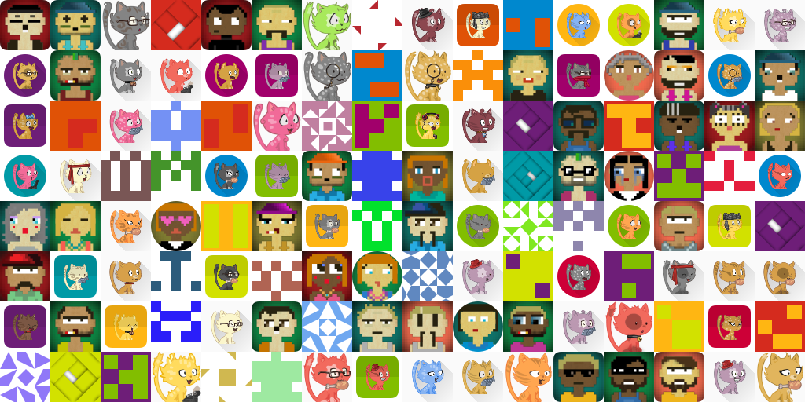
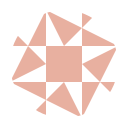
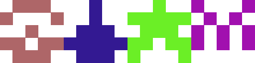
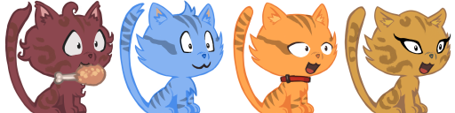
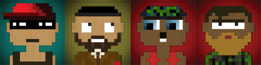
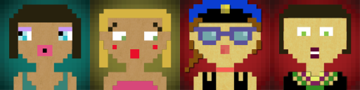

# Avatar Builder

Avatar builder, build multi avatar (cat, github, 8bit, square, identicon, etc) or compose avatar



## Install

```bash
npm install avatar-builder --save
```

## Usage

```javascript
const Avatar = require('./lib');

const avatar = Avatar.builder(Avatar.Image.margin(Avatar.Image.circleMask(Avatar.Image.identicon())),128,128, {cache: Avatar.Cache.lru()});
avatar.create('gabriel').then(buffer => fs.writeFileSync('avatar-gabriel.png', buffer));
avatar.create('allaigre').then(buffer => fs.writeFileSync('avatar-allaigre.png', buffer));
```




> Content typescript definition

More example in [sample.js](./sample.js)

## Predefined avatar

### Triangle

**Example 1 :**

```javascript
const Avatar = require('./lib');

const avatar = Avatar.triangleBuilder(128);

avatar.create('gabriel').then(buffer => {/* png buffer */});
```


### Square

Source : https://github.com/flouthoc/minBlock.js

**Example 1 :**

```javascript
const Avatar = require('./lib');

const avatar = Avatar.squareBuilder(128);

avatar.create('gabriel').then(buffer => {/* png buffer */});
```


### Identicon

Source : https://github.com/donpark/identicon

**Example 1 :**

```javascript
const Avatar = require('./lib');

const avatar = Avatar.identiconBuilder(128);

avatar.create('gabriel').then(buffer => {/* png buffer */});
```


### GitHub

**Example 1 :**

```javascript
const Avatar = require('./lib');

const avatar = Avatar.githubBuilder(128);

avatar.create('gabriel').then(buffer => {/* png buffer */});
```



### Cat

Images sources :  CC-By 4.0 attribution: David Revoy https://framagit.org/Deevad/cat-avatar-generator

**Example 1 :**

```javascript
const Avatar = require('./lib');

const avatar = Avatar.catBuilder(128);

avatar.create('gabriel').then(buffer => {/* png buffer */});
```



**Example 2 :**

```javascript
const Avatar = require('./lib');

const avatar = Avatar.builder(
                 Avatar.Image.margin(Avatar.Image.roundedRectMask(Avatar.Image.compose(
                   Avatar.Image.randomFillStyle(),
                   Avatar.Image.shadow(Avatar.Image.margin(Avatar.Image.cat(), 8), {blur: 5, offsetX: 2.5, offsetY: -2.5,color:'rgba(0,0,0,0.75)'})
                 ), 32), 8),
                 128, 128);

avatar.create('gabriel').then(buffer => {/* png buffer */});
```


### 8 bit

Images sources : https://github.com/o1egl/govatar

**Example 1 :**

```javascript
const Avatar = require('./lib');

const avatar = Avatar.male8bitBuilder(128);

avatar.create('gabriel').then(buffer => {/* png buffer */});
```



**Example 2 :**

```javascript
const Avatar = require('./lib');

const avatar = Avatar.female8bitBuilder(128);

avatar.create('gabriel').then(buffer => {/* png buffer */});
```




## Cache

Compose cache

**Example, cache with lru and folder**

```javascript
const Avatar = require('./lib');

const avatar = Avatar.catBuilder(128, { cache: Avatar.Cache.compose(Avatar.Cache.lru(), Avatar.Cache.folder()) });

avatar.create('gabriel').then(buffer => {/* png buffer */});
```

## Functions

### Builder

| function | description |
| --- | --- |
| `Avatar.builder(image,width,height,options)` | Create a avatar builder with image builder and size and options |
| `Avatar.catBuilder(size,options)` | Create a cat avatar builder with size and options |
| `Avatar.githubBuilder(size,precision,options)` | Create a github avatar builder with size and options |
| `Avatar.triangleBuilder(size,prevision,colors,options)` | Create a triangle avatar builder with size and options |
| `Avatar.identiconBuilder(size,options)` | Create a identicon avatar builder with size and options |
| `Avatar.squareBuilder(size,precision,colors,options)` | Create a square avatar builder with size and options |
| `Avatar.female8bitBuilder(size,options)` | Create a 8bit female avatar builder with size and options |
| `Avatar.male8bitBuilder(size,options)` | Create a 8bit male avatar builder with size and options |

### Image builder

| function | description |
| --- | --- |
| `Avatar.Image.compose(images)` | Compose images |
| `Avatar.Image.random(images)` | Choose random image in list |
| `Avatar.Image.margin(image,margin)` | Add margin to image |
| `Avatar.Image.fillStyle(fillStyle)` | Solid image with color |
| `Avatar.Image.randomFillStyle(fillStyles)` | Solid image with random color |
| `Avatar.Image.circleMask(image)` | Circle mask |
| `Avatar.Image.roundedRectMask(image,radius)` | Rounded rect mask |
| `Avatar.Image.shadow(image,shadow)` | Add shadow below image |
| `Avatar.Image.scoreShadow(image,shadowColor)` | Add score shadow above image |
| `Avatar.Image.longShadow(image,shadowColor)` | Add long shadow below image |
| `Avatar.Image.group(pathLocation,groups)` | Compose png by group |
| `Avatar.Image.identicon(patchSize,backgroundColor)` | Create a identicon image |
| `Avatar.Image.square(precision,colors)` | Create mini block image |
| `Avatar.Image.triangle(precision,colors)` | Create triangle image |
| `Avatar.Image.github(precision)` | Create github image |
| `Avatar.Image.cat()` | Create cat image |
| `Avatar.Image.male8bit()` | Create male 8bit image |
| `Avatar.Image.female8bit()` | Create female 8bit image |
| `Avatar.Image.grid(image,gridx,gridy)` | Create grid with gridx * gridy images |

### Cache

| function | description |
| --- | --- |
| `Avatar.Cache.memory()` | Use memory cache, all elements in map |
| `Avatar.Cache.lru(options)` | Use LRU cache (default max 50 elements) |
| `Avatar.Cache.folder(location)` | Save element in folder (default ./tmp/avatar) |
| `Avatar.Cache.compose(caches)` | Compose multi cache |
